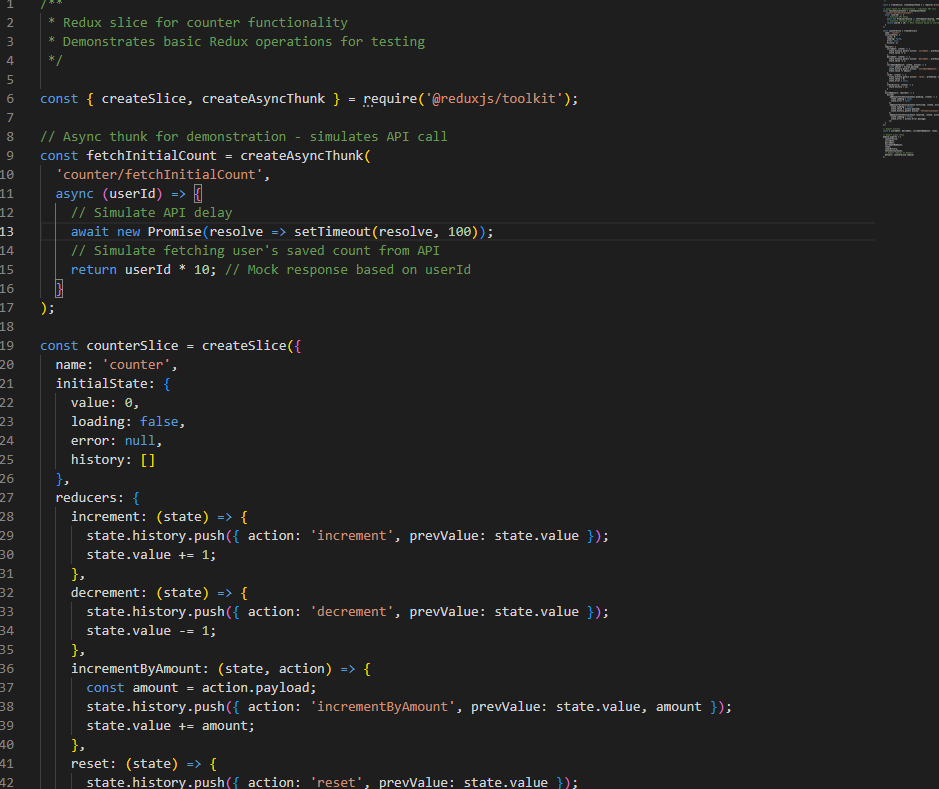
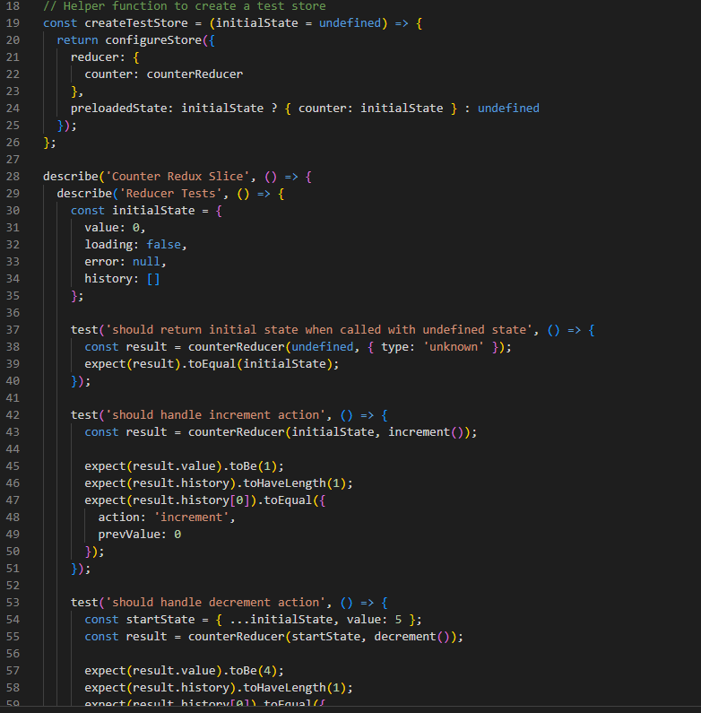
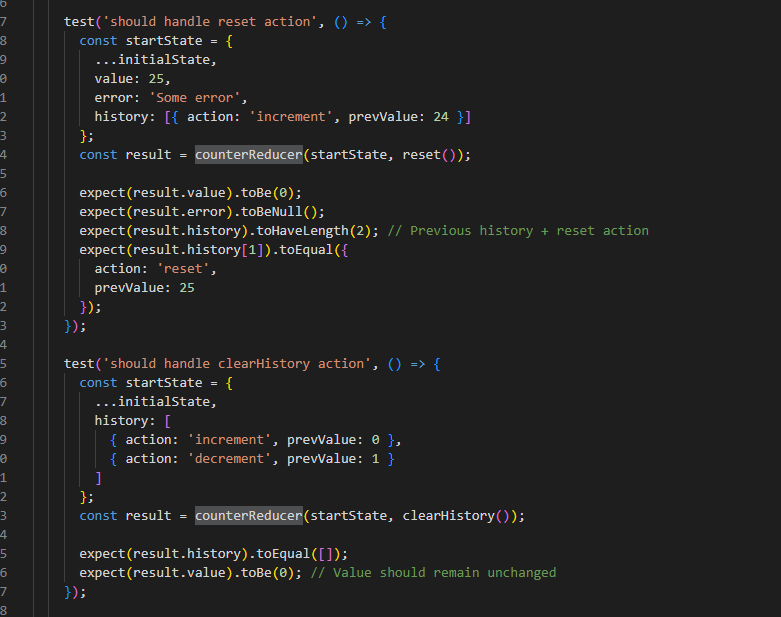
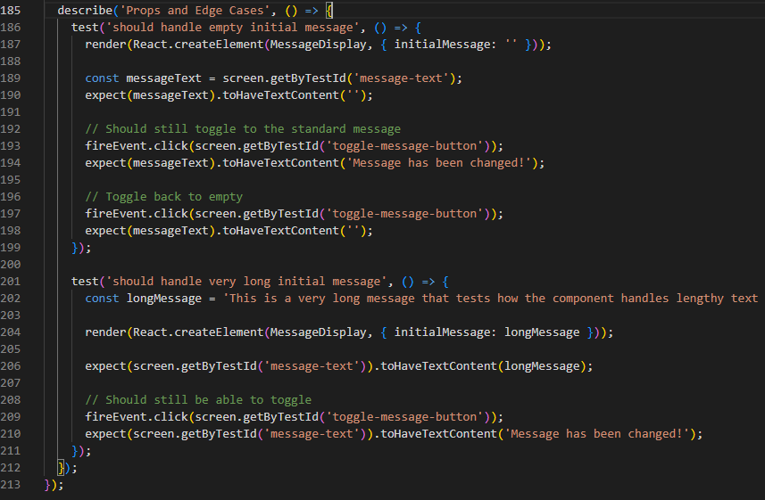

# Testing Redux with Jest

## What was the most challenging part of testing Redux?

The most challenging part was testing async thunks - it's like trying to test a conversation between two people when one person takes time to respond. In my counterSlice, I created fetchInitialCount that simulates an API call, and testing it required understanding how Redux Toolkit handles pending, fulfilled, and rejected states. I had to learn how to test each state separately by creating mock actions with specific types, and also test the complete flow using a real store with store.dispatch(). Another challenge was making sure my tests didn't interfere with each other, so I created a helper function createTestStore() to get fresh state for each test.
Here is my counterSlice.js file:

Here is my counterSlice.test.js file:

## How do Redux tests differ from React component tests?

Redux tests are like testing the engine of a car while React component tests are like testing how well the driver uses the car. With Redux, I'm testing pure functions (reducers) that take state and action as input and return new state - no UI, no user interactions, just data transformation. In my Redux tests, I directly call counterReducer() with different actions and check if the state changes correctly. React component tests focus on what users see and do - clicking buttons, reading text, filling forms. Redux tests are more predictable because there's no DOM rendering, no async behavior from user events, and no need for cleanup after each test.

Redux test:

React component test:

