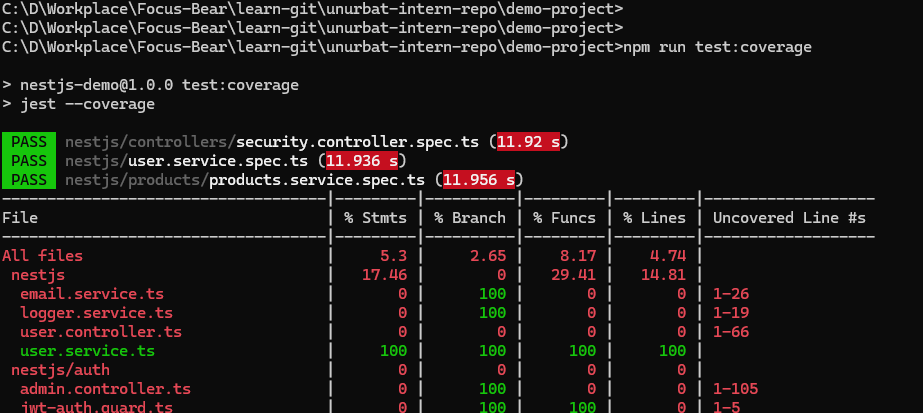
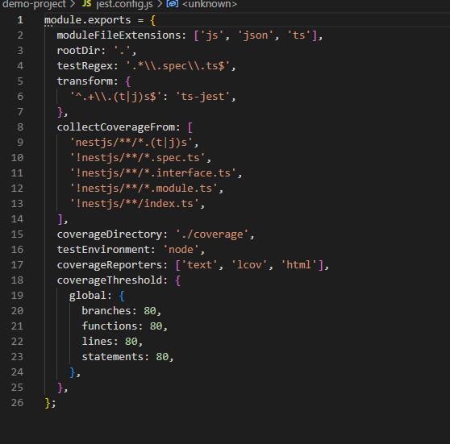
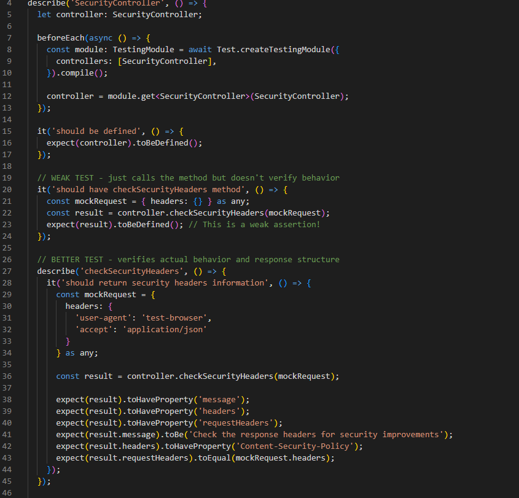
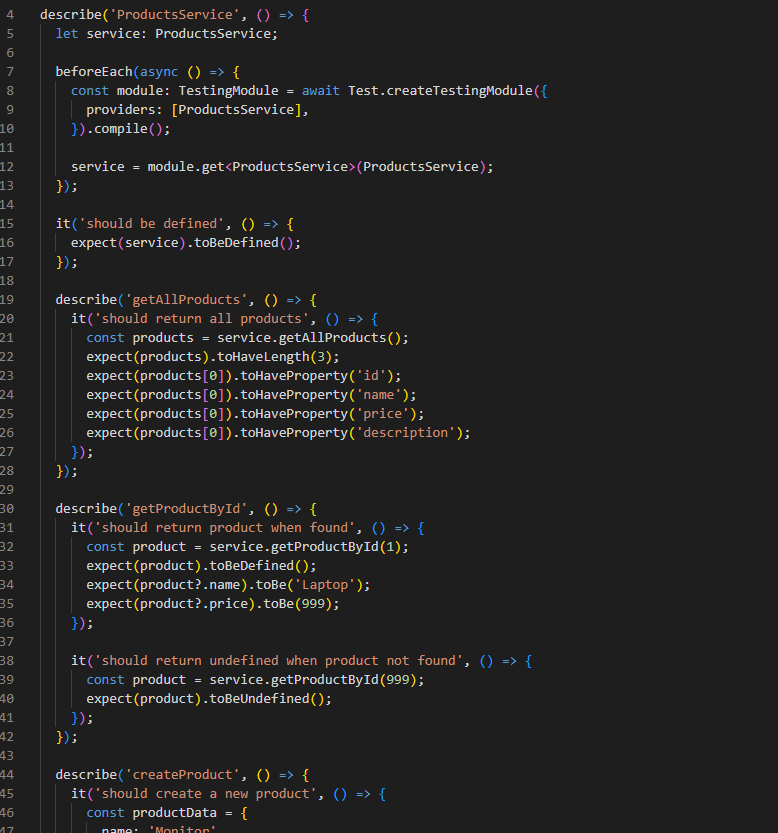

# Understanding the Focus Bear Coverage Bar & Writing Meaningful Tests

## What does the coverage bar track, and why is it important?

The coverage bar tracks how much of my code is actually tested. It shows percentages for statements, branches, functions, and lines. In the demo project, I set up Jest to require 80% coverage, but I only got 5.33% coverage because most files don't have tests yet. The coverage bar helps me see which parts of my code aren't tested so I know what needs more tests.

## Why does Focus Bear enforce a minimum test coverage threshold?

Focus Bear wants at least 80% test coverage to make sure the app is stable and won't break when deployed. Without tests, bugs can slip through and cause problems for users. The threshold forces developers to write tests for their code, which catches bugs early and makes the codebase more reliable. It's like having a safety net that prevents broken code from reaching production.

## How can high test coverage still lead to untested functionality?

I learned that just having high coverage numbers doesn't mean the tests are actually good. In my SecurityController test, I wrote a weak test that just called a method and checked if the result existed, but didn't verify what the result actually contained. This gives coverage but doesn't test real behavior. You can have 100% coverage with tests that don't catch bugs because they don't check the right things.

## What are examples of weak vs. strong test assertions?

Weak assertions just check if something exists, like `expect(result).toBeDefined()`. Strong assertions verify actual behavior, like `expect(result.message).toBe('expected message')`. In my ProductsService tests, I wrote strong assertions that check if new products get the right ID, if updates preserve unchanged fields, and if deletions actually remove items. Strong tests catch real bugs while weak tests just boost coverage numbers.

## How can you balance increasing coverage with writing effective tests?

I focus on testing the important business logic first, then fill in coverage gaps. When I see uncovered lines in the coverage report, I ask if they're worth testing or just boilerplate code. I write meaningful assertions that verify the actual behavior users care about, not just that methods don't crash. It's better to have 70% coverage with strong tests than 90% coverage with weak ones that don't catch real problems.