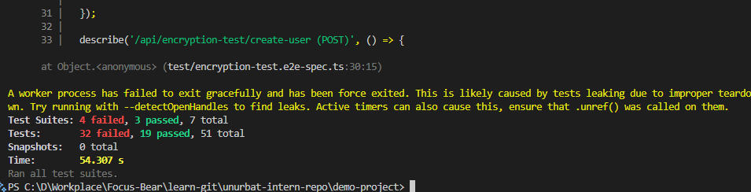

# Using Jest & Supertest for API Testing in NestJS

## How does Supertest help test API endpoints?

Supertest is like having a robot that can make fake requests to my API to see if it works correctly. Instead of opening a browser and clicking around, I can write code that sends GET and POST requests to my endpoints and checks if they respond properly. In my demo project, I used Supertest to test my security controller by making requests to `/api/security/headers` and verifying it returned the right data with proper status codes.

## What is the difference between unit tests and API tests?

Unit tests check if individual pieces of code work by themselves, like testing if a single function adds two numbers correctly. API tests check if the whole system works together when someone makes a real request to the website. In my demo project, I wrote unit tests for my ProductsService to check if it could add and remove products from a list. 

Then I wrote API tests that actually sent HTTP requests to my endpoints to see if the controller, service, and everything else worked together properly.

## Why should authentication be mocked in integration tests?

Mocking authentication means creating fake login tokens instead of using real ones in tests. This makes tests faster because I don't need to actually log in every time, and I can easily pretend to be different types of users. In my demo project, I created fake JWT tokens using the same secret key my app uses, so I could test protected endpoints without having to create real user accounts or go through the whole login process.

## How can you structure API tests to cover both success and failure cases?

I organized my tests into two main groups: happy path tests that check when everything works correctly, and edge case tests that check when things go wrong. For my security endpoints, I tested both successful requests that return the right data and failed requests with missing data or invalid tokens. I used describe blocks to group related tests together and wrote clear test names that explain exactly what each test is checking.

## What I implemented in the demo project

I created four main test files in the demo project to show different testing scenarios. The security.e2e-spec.ts file tests GET endpoints and checks response headers. The encryption-test.e2e-spec.ts file tests POST endpoints with different data inputs. The users-validation.e2e-spec.ts file shows how to test input validation. The auth-mock.e2e-spec.ts file demonstrates mocking authentication for protected routes.

