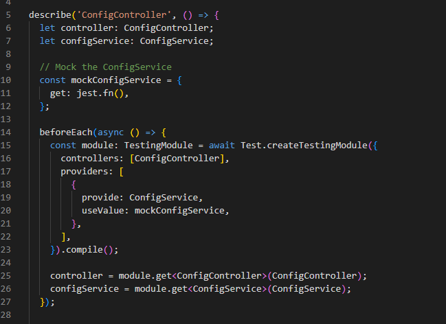

# Writing Unit Tests for Services & Controllers in NestJS

## Why is it important to test services separately from controllers?

Testing services and controllers separately is like checking each ingredient before making a recipe - you want to make sure each part works perfectly on its own before combining them. In my demo project, I tested EmailService by itself to make sure it correctly formats messages and tracks email history. Then I tested ConfigController separately to verify it properly handles API requests and returns the right response format. This way, if something breaks, I know exactly which piece is the problem instead of having to debug a whole mixed-up system.

## How does mocking dependencies improve unit testing?

Mocking dependencies is like using fake props in a play - you don't need the real sword to practice your acting, just something that looks like one. In my ConfigController tests, I created a fake ConfigService that gives me exactly the responses I want to test, without needing to set up a real configuration system. This makes my tests run super fast and lets me test weird situations like missing configuration values or service errors that would be hard to create with real services.

## What are common pitfalls when writing unit tests in NestJS?

The biggest mistake I made at first was forgetting to clear mocks between tests, which caused tests to interfere with each other like dirty dishes affecting the next meal. In my advanced-mocking.spec.ts file, I learned to use `jest.clearAllMocks()` in afterEach to reset everything. Another problem was not properly mocking external modules like the file system - I had to use `jest.mock('fs')` at the top of the file to replace Node.js modules. Also, I initially forgot to use `getRepositoryToken()` when mocking TypeORM repositories, which caused injection errors.

## How can you ensure that unit tests cover all edge cases?

I test edge cases by thinking "what could go wrong?" and writing tests for each scenario. In my EmailService tests, I tested normal cases like sending emails, but also weird cases like empty messages, very long emails, and special characters in names. For my LoggerService, I tested that different instances get different IDs and that timestamps are accurate. I also test error scenarios where services throw exceptions, network calls fail, or configuration is missing. It's like testing a car by driving normally, but also checking what happens in rain, snow, or when the gas runs out.

